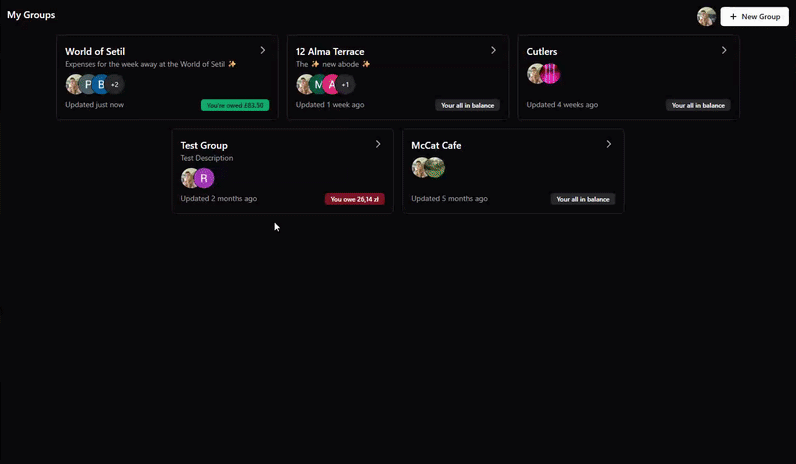
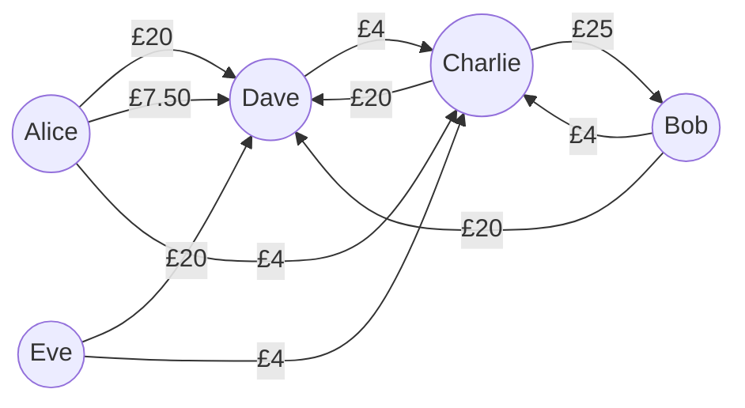
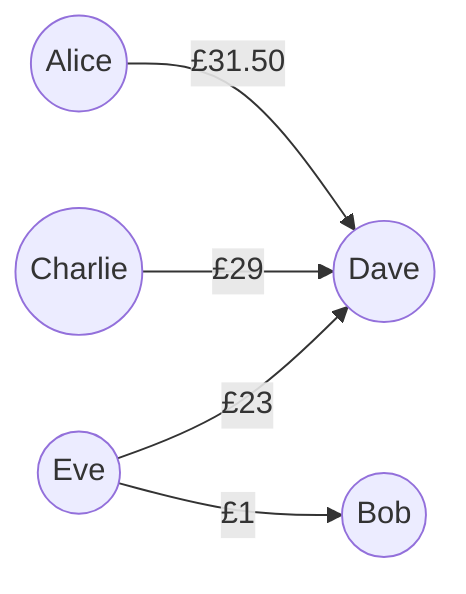

#  &nbsp; Setil

**The modern, real-time cost-splitting app built for simplicity.**

Setil is a mobile-first progressive web app designed to simplify group expenses. Create a group, invite friends, and add expenses in seconds. Powered by Vue 3 and Firebase, Setil tracks every transaction in real-time, automatically calculating the most efficient way for everyone to setil up.

<p align="center">
  
</p>

<p align="center">
  <a href="https://setil.joelcutler.dev/">
    <strong>Open Setil ⟶</strong>
  </a>
</p>

## Features

- 💸 **Smart Settlement**: Uses a greedy algorithm to simplify complex debts into the fewest possible payments.
- 🔥 **Real-time**: Powered by Firestore; balances and transactions update instantly across all devices.
- 🍰 **Flexible Splitting**: Split a single transaction between multiple people equally, or define specific amounts.
- 📱 **PWA Support**: Installable on iOS, Android, and Desktop for a native experience.
- 🔔 **Notifications**: Real-time alerts for new members, transactions, and payments.
- 🎨 **Modern UI**: Built using shadcn/vue, and Tailwind CSS for a clean and accessible mobile-first interface.
- 🔒 **Secure Auth**: Seamless and secure login via Google Authentication.
- ☁️ **Serverless**: Hosted on Vercel utilising Edge functions for high-performance API.

## Tech Stack

- **Frontend**: Vue.js 3, Vite
- **UI Components**: shadcn/vue, Tailwind CSS
- **Database**: Firebase Firestore
- **Authentication**: FIrebase Auth (Google)
- **Deployment**: Vercel (Frontend & Edge Functions)

## Setil Logic

Setil uses a greedy algorithm to resolve debts in $O(n)$ time. Instead of tracking individual "who owes who" records for every transaction, it maintains a global balance for each user within the group.

The `resolveGroupDebts` function ([SettleUpPage.vue](src/pages/SettleUpPage.vue)) categorises users into Creditors and Debtors, then matches them (using a highest absolute value heuristic) to minimise the total number of transfers.

Example

- Dave pays £100 for the Airbnb, split amongst all 5.
- Bob pays £50 for fuel, split between himself and Charlie.
- Dave pays £15 for snacks, split between Alice and himself.
- Charlie pays £20 for parking, split amongst all 5.



Global Balance Calculations:

| Person  | Airbnb       | Fuel       | Snacks     | Parking    | Total                |
| ------- | ------------ | ---------- | ---------- | ---------- | -------------------- |
| Alice   | -(100/5)     |            | -(15/2)    | -(20/5)    | -£31.50 _(debtor)_   |
| Bob     | -(100/5)     | -(50/2)+50 |            | -(20/5)    | +£1.00 _(creditor)_  |
| Charlie | -(100/5)     | -(50/2)    |            | -(20/5)+20 | -£29.00 _(debtor)_   |
| Dave    | -(100/5)+100 |            | -(15/2)+15 | -(20/5)    | +£83.50 _(creditor)_ |
| Eve     | -(100/5)     |            |            | -(20/5)    | -£24.00 _(debtor)_   |

Therefore, recommended payments by matching creditors with debtors:

- Alice sends £31.50 to Dave
- Charlie sends £29 to Dave
- Eve sends £23 to Dave
- Eve sends £1 to Bob



## Local Development

### 1. Clone & Install Dependencies

```bash
git clone https://github.com/jcbyte/setil.git
cd setil
npm install
```

### 2. Set Environment Variables

Setil uses environment variables for the Firebase Web SDK, Firebase Admin SDK, Cloudinary SDK, encryption keys, and maintenance mode; all documented in [`.env.example`](.env.example).

If using Vercel, link the repository and pull its Development variables:

```bash
npx vercel link
npx vercel env pull .env.local --environment=development
```

Otherwise, create and populate the local environment file from the template:

```bash
cp .env.example .env.local
```

### 3. Start Local Server

```bash
npm run dev
```

Or, to run Vercel Edge Functions locally:

```bash
npx vercel dev
```

## Licence

[Apache License 2.0](LICENSE)
